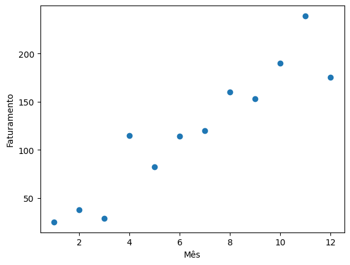
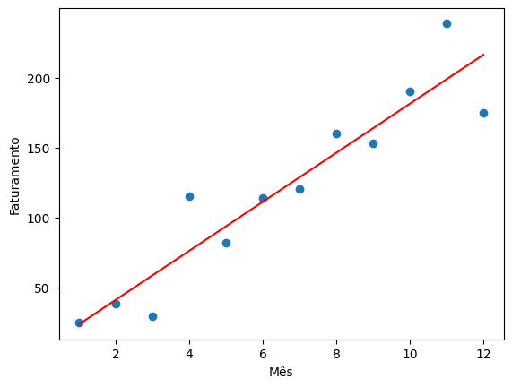
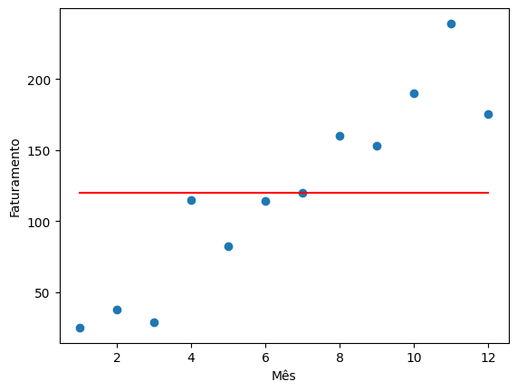
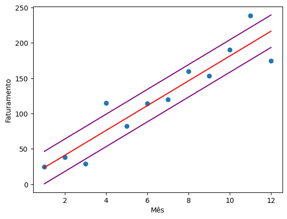
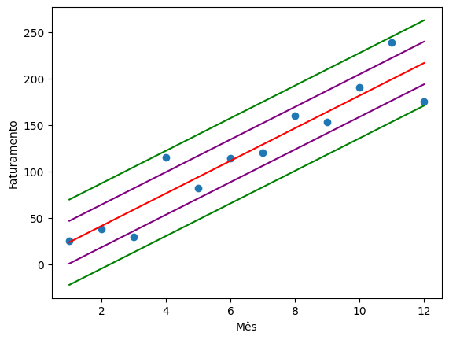
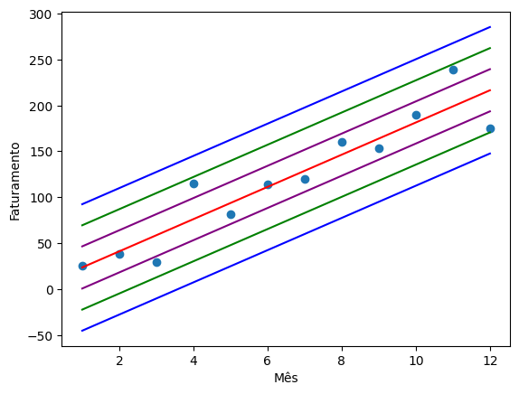

## Regressão Linear

A **regressão linear** é uma técnica estatística utilizada para **prever valores de variáveis** com base em outras variáveis de valores conhecidos. Em outras palavras, ela permite **estabelecer uma relação entre duas variáveis**. Essa técnica é frequentemente empregada para **identificar padrões e tendências em conjuntos de dados** e também para **prever o valor de uma variável chamada de variável dependente**.

Aqui estão alguns pontos importantes sobre a regressão linear:

1.  **Modelo Simples**: A **regressão linear simples** é um tipo de modelo estatístico que visa indicar como uma **variável dependente (Y)** se comporta em relação a uma ou mais **variáveis independentes (X)**. No caso da regressão linear simples, utilizamos apenas **uma variável independente** e uma variável dependente. Se houver mais de uma variável independente, recorremos à **regressão linear múltipla**.
    
2.  **Exemplos de Aplicação**:
    
    * Verificar se a **temperatura atual influencia no crescimento de uma massa de pão** ou em sua fermentação.
    * Avaliar o **coeficiente de inteligência de uma pessoa com base em sua idade**.
3.  **Utilização**:
    
    * Verificar se **uma variável tem alguma relação com outra**.
    * Fazer **previsões de uma variável com base no valor de outra variável**.

Em resumo, a regressão linear é uma ferramenta poderosa para explorar relações entre variáveis e entender como elas se influenciam mutuamente.

Agora vou mostrar um exemplo simples de sua usabilidade, utilizando sua fórmula padrão, e algumas bibliotecas que facilitam seu uso!

### Importar pandas e matplotlib

```python
import pandas as pd
import matplotlib.pyplot as plt 
```

### Criar um Data Frame de faturamento mensal de 12 meses

```python
faturamento = [25,38,29,115,82,114,120,160,153,190,239,175]
mes = list(range(1,13))

```
```python
Output[mes]: [1, 2, 3, 4, 5, 6, 7, 8, 9, 10, 11, 12]
```

```python
data_dict = {'mes': mes, 'faturamento': faturamento}
data = pd.DataFrame.from_dict(data_dict)
```
|     | mes | faturamento |
| --- | --- | --- |
| 0   | 1   | 25  |
| 1   | 2   | 38  |
| 2   | 3   | 29  |
| 3   | 4   | 115 |
| 4   | 5   | 82  |
| 5   | 6   | 114 |
| 6   | 7   | 120 |
| 7   | 8   | 160 |
| 8   | 9   | 153 |
| 9   | 10  | 190 |
| 10  | 11  | 239 |
| 11  | 12  | 175 |

### Visualizar dados em Gráfico de Dispersão
```python
x = data['mes']
y = data['faturamento']
plt.scatter(x,y)
```


O **gráfico de dispersão** é uma ferramenta gráfica amplamente utilizada em estatística e outras áreas do conhecimento para visualizar a relação entre **duas variáveis quantitativas**. Vamos explorar em detalhes o que é um gráfico de dispersão, como interpretar seus resultados e como aplicá-lo em diferentes contextos:

**Como Interpretar um Gráfico de Dispersão?**
- **Direção e Forma da Nuvem de Pontos**:
    - Observe a direção e a forma da nuvem de pontos.
    - Se os pontos estiverem distribuídos aleatoriamente, sem uma tendência clara, isso indica que não há correlação entre as variáveis.
    - Caso haja uma tendência, como uma linha reta ascendente ou descendente, isso sugere uma relação linear entre as variáveis.

## Criar Modelo Preditivo aplicando fórmulas (manualmente)

**Equação da Regressão Linear**

  
Essa é a equação para desenhar uma reta. Mas quando usamos essa equação para criar uma Regressão Linear especificamente, colocamos o acento circunflexo no y.

$$\\hat{y} = mx + b$$

**m** = inclinação da linha  
**b** = interceptação do y  
**(x,y)** = pontos coordenados  

$$m = \\frac {n\\sum {xy}-\\sum x \\sum y}{n\\sum x^2-(\\sum x)^2}$$

$$b = \\frac {\\sum y-m\\sum x}{n}$$

## Cálculo de m
```python
x.sum()
```
```python
Output[x.sum]: 78
```
```python
y.sum()
```
```python
Output[y.sum]: 1440
```

```python
x*y
```

```python
Output[x*y]:
0       25
1       76
2       87
3      460
4      410
5      684
6      840
7     1280
8     1377
9     1900
10    2629
11    2100
dtype: int64
```
```python
(x*y).sum()
```
```python
Output[(x*y).sum() ]: 11868
```

```python
x**2
```

```python
Output[x**2]:
0       1
1       4
2       9
3      16
4      25
5      36
6      49
7      64
8      81
9     100
10    121
11    144
Name: mes, dtype: int64
```

```python
(x**2).sum()
```

```python
Output[(x**2).sum()]: 650
```

```python
len(data)
```
```python
Output[len(data)]:12
```
Agora que construímos as ferramentas necessárias, podemos aplicar a fórmula:
$$m = \\frac {n\\sum {xy}-\\sum x \\sum y}{n\\sum x^2-(\\sum x)^2}$$

Aplicando puramente no código teremos:
```python
m = (len(data) * (x*y).sum() - x.sum()*y.sum()) / (len(data) * (x**2).sum() - (x.sum())**2)
m.round(4)
```

```python
Output[m]: 17.5385

```

## Cálculo de b
Nossa fórmula de b é:
$$b = \\frac {\\sum y-m\\sum x}{n}$$

Então, basta aplicar de tal forma:
```python
b = ( y.sum() - m*x.sum() ) / len(data)
b.round()
```
```python
Output[b.round]: 6.0
```
### Modelo Preditivo
Com nossas variáveis já criadas, vamos seguir para a criação do modelo preditivo.
Criar modelo preditivo para prever (ou estimar) o rendimento de qualquer mês:

$$\\hat{y} = mx + b$$

```python
xpred = 4
```

```python
ypred = m*xpred + b
ypred
```

```python
Output[ypred]: 76.15384615384615
```

### Predições para os 12 meses
Criar uma lista contendo as predições para cada um dos 12 meses:

```python
predicoes = []
for elemento in x:
    ypred = m*elemento + b
    predicoes.append(ypred)
```

```python
y-predicoes
```

```python
Output[y-predicoes]:

0      1.461538
1     -3.076923
2    -29.615385
3     38.846154
4    -11.692308
5      2.769231
6     -8.769231
7     13.692308
8    -10.846154
9      8.615385
10    40.076923
11   -41.461538
Name: faturamento, dtype: float64
```
## Inserir predições no DataFrame

```python
data['predicoes'] = predicoes
```
### Visualizar Regressão Linear

```python
plt.scatter(x,y)
plt.plot(x,predicoes,color='red')
```



## Coeficiente de Determinação - R-quadrado (R²)

O **coeficiente de determinação**, também conhecido como **R²** ou **R-ao-quadrado**, é uma medida estatística que avalia a **qualidade do ajuste** de um modelo de regressão. Vamos explorar o que isso significa:

1.  **Definição**:
    
    * O coeficiente de determinação é a proporção da **variação total da variável explicada pela regressão**.
    * Tecnicamente, ele é a porcentagem da **variação da variável resposta que é explicada por um modelo linear**.
    * O R² está sempre entre 0% e 100%:
        * **0%** indica que o modelo não explica nada da variabilidade dos dados de resposta ao redor de sua média.
        * **100%** indica que o modelo explica toda a variabilidade dos dados de resposta ao redor de sua média.
2.  **Interpretação**:
    
    * Quanto **maior** o R², **melhor** o modelo se ajusta aos seus dados.
    * No entanto, existem **condições importantes** para esta diretriz.
    * **Valores baixos** de R² nem sempre são ruins, e **valores altos** de R² nem sempre são bons!
    * Representação gráfica do R²:
        * Plotar os valores ajustados pelos valores observados ilustra graficamente diferentes valores de R² para os modelos de regressão.
        * Quanto mais variância for explicada pelo modelo de regressão, mais próximos os pontos de dados estarão em relação à linha de regressão ajustada.

Em resumo, o R² nos informa **quanto do erro de previsão na variável y é eliminado quando usamos a regressão de mínimos quadrados sobre a variável x**. É uma ferramenta essencial para avaliar a eficácia do modelo de regressão. 📊🔍

$$R^2 = 1 - \\frac {SQ_{res}} {SQ_{tot}} = 1 - \\frac {\\sum (y\_i - \\hat{y}\_i)^2}{\\sum (y_i - \\overline y)^2} $$

### Calcular Soma Quadrática dos Resíduos (SQres)

A Soma Quadrática dos Resíduos (SQres), também conhecida como soma dos quadrados dos resíduos, é uma medida de discrepância entre os dados observados e uma função estatística estimada.

Em um modelo de regressão, um resíduo é a diferença entre o valor observado e o valor previsto pelo modelo. A soma quadrática dos resíduos é a soma dos quadrados dessas diferenças.

```python
data['residuos'] = y-predicoes
```

```python
data['residuos']**2
```
```python
Output[data['residuos']**2]:

0        2.136095
1        9.467456
2      877.071006
3     1509.023669
4      136.710059
5        7.668639
6       76.899408
7      187.479290
8      117.639053
9       74.224852
10    1606.159763
11    1719.059172
Name: residuos, dtype: float64
```

```python
(data['residuos']**2).sum()
```

```python
Output[(data['residuos']**2).sum()]: 6323.538461538462
```
```python
SQres = (data['residuos']**2).sum()
```
```python
Output[SQres]: 6323.538461538462
```

### Calcular Soma Quadrática Total (SQtot)

A Soma Quadrática Total (SQtot) mede a variabilidade total dos dados em torno da média de y, ou seja, o quanto os valores observados variam antes de usarmos qualquer modelo.

Ela é a soma dos quadrados das diferenças entre cada valor observado e a média. Comparando SQres com SQtot, descobrimos qual fração dessa variabilidade o modelo consegue explicar.

```python
media = y.mean()
```

```python
Output[media]:120.0
```

```python
data['y_medio'] = media
```

```python
Output[data]:
```

|     | mes | faturamento | predicoes | residuos | y_medio |
| --- | --- | --- | --- | --- | --- |
| 0   | 1   | 25  | 23.538462 | 1.461538 | 120.0 |
| 1   | 2   | 38  | 41.076923 | -3.076923 | 120.0 |
| 2   | 3   | 29  | 58.615385 | -29.615385 | 120.0 |
| 3   | 4   | 115 | 76.153846 | 38.846154 | 120.0 |
| 4   | 5   | 82  | 93.692308 | -11.692308 | 120.0 |
| 5   | 6   | 114 | 111.230769 | 2.769231 | 120.0 |
| 6   | 7   | 120 | 128.769231 | -8.769231 | 120.0 |
| 7   | 8   | 160 | 146.307692 | 13.692308 | 120.0 |
| 8   | 9   | 153 | 163.846154 | -10.846154 | 120.0 |
| 9   | 10  | 190 | 181.384615 | 8.615385 | 120.0 |
| 10  | 11  | 239 | 198.923077 | 40.076923 | 120.0 |
| 11  | 12  | 175 | 216.461538 | -41.461538 | 120.0 |

```python
y_medio = data['y_medio']
```
```python
plt.scatter(x,y)
plt.plot(x,y_medio,color='red')
```


```python
data['total'] = y - data['faturamento'].mean()  
```

```python
(data['total']**2)
```

```python
Output[(data['total']**2)]:

0      9025.0
1      6724.0
2      8281.0
3        25.0
4      1444.0
5        36.0
6         0.0
7      1600.0
8      1089.0
9      4900.0
10    14161.0
11     3025.0
Name: total, dtype: float64
```
```python
(data['total']**2).sum()
```

```python
Output[(data['total']**2).sum()]: 50310.0
```

```python
SQtot = (data['total']**2).sum()
```

```python
Output[SQtot = (data['total']**2).sum()]: 50310.0
```

### Calcular R-quadrado
Agora, com as variáveis prontas, podemos finalmente calcular o R quadrado, de tal forma:
```python
r_quadrado = 1-SQres/SQtot
r_quadrado.round(4)
```

```python
Output[r_quadrado.round(4)]: 0.8743
```

## RMSE

Raiz do Erro Quadrático Médio.

A Raiz do Erro Quadrático Médio (RMSE, do inglês Root Mean Square Error) é uma métrica utilizada para avaliar a performance de modelos de regressão. Ela é calculada a partir da diferença entre os valores reais e os valores previstos pelo modelo.

A RMSE é a raiz quadrada do Erro Quadrático Médio (MSE, do inglês Mean Squared Error). O MSE é a média dos quadrados das diferenças (ou erros) entre os valores reais e os valores previstos.

A RMSE é uma medida útil porque penaliza erros grandes, o que pode ser útil em muitos casos onde um erro grande é indesejável. Além disso, a RMSE tem a mesma unidade que a variável dependente, o que facilita a interpretação.

Aqui está sua fórmula:

$$ e = y_i - \hat{y_i} $$ 

$$ RMSE = \sqrt {\sum \frac {e^2}{n}} $$

```python
(data['residuos']**2).sum()
```

```python
Output[(data['residuos']**2).sum()]: 6323.538461538462
```

Para o cálculo do RMSE teremos que importar a biblioteca numpy do python

```python
import numpy as np
rmse = np.sqrt((data['residuos']**2).sum() / len(data['residuos']) )
```
Assim temos o rmse de:
```python
Output[rmse]:22.95564284574794
```

Vamos ver o output das predicoes:
```python
Output[predicoes]:

[23.538461538461522,
 41.07692307692306,
 58.6153846153846,
 76.15384615384615,
 93.6923076923077,
 111.23076923076923,
 128.76923076923075,
 146.3076923076923,
 163.84615384615384,
 181.3846153846154,
 198.9230769230769,
 216.46153846153845]
```
## Regra Empírica 68-95-99.7
O que é Regra Empírica?
A **Regra Empírica**, também conhecida como **Regra 68-95-99.7**, oferece uma diretriz aproximada para entender a distribuição de dados em uma **distribuição normal** (gaussiana). Essa regra se baseia nas características da distribuição normal, que possui simetria e forma de sino. Vamos explorar os principais pontos dessa regra:

1. **68% dos dados** estão contidos dentro de **um desvio padrão** a partir da média (μ ± 1σ).
2. **95% dos dados** estão dentro de **dois desvios padrão** a partir da média (μ ± 2σ).
3. **99,7% dos dados** se encontram dentro de **três desvios padrão** da média (μ ± 3σ).

Como temos as predições, vamos aplicar a  regra empírica e visualizar as retas para cada desvio padrão.

```python
um_acima = predicoes+rmse
um_abaixo = predicoes-rmse
```

```python
dois_acima = predicoes+2*rmse
dois_abaixo = predicoes-2*rmse
```

```python
tres_acima = predicoes+3*rmse
tres_abaixo = predicoes-3*rmse
```
## Um desvio padrão 68%
```python
plt.scatter(x,y)
plt.plot(x,predicoes,color='red')
plt.plot(x,um_acima,color='purple')
plt.plot(x,um_abaixo,color='purple')
```



## Dois desvios padrões 95%

```python
plt.scatter(x,y)
plt.plot(x,predicoes,color='red')
plt.plot(x,um_acima,color='purple')
plt.plot(x,um_abaixo,color='purple')
plt.plot(x,dois_acima,color='green')
plt.plot(x,dois_abaixo,color='green')
```



## Três desvios padrões 99.7%

``` python
plt.scatter(x,y)
plt.plot(x,predicoes,color='red')
plt.plot(x,um_acima,color='purple')
plt.plot(x,um_abaixo,color='purple')
plt.plot(x,dois_acima,color='green')
plt.plot(x,dois_abaixo,color='green')
plt.plot(x,tres_acima,color='blue')
plt.plot(x,tres_abaixo,color='blue')
```



## Temos que fazer TUDO isso para uma regressão?
### A resposta é... não!
O intuito de mostrar tudo isso, é para vermos que nada é feito por mágica! Agora que sabemos o que constrói uma regressão linear, podemos facilitar nossa vida utilizando bibliotecas no python para fazer isso para nós.

Sabendo como funciona uma regressão linear, nos ajuda a ter uma intuição e compreensão maior na hora que vamos usar essas bibliotecas, assim podendo facilitar muitos passos na hora da construção de um modelo, e entender o que está acontecendo com ele.

Agora com essa intuição desenvolvida, vamos usar duas das mais famosas bibliotecas que o python oferece, sendo elas o *Scikit-learn* e o *Statsmodels*.

Com a intuição formada, será simples de perceber o ''que é o que'' na construção desses modelos. Com isso dito serei breve na construção utilizando as bibliotecas.

Para curiosidade, é muito legal analisar os valores calculados pelas bibliotecas e o que fizemos à mão acima, pois vemos que poupamos muitos passos para chegar nos mesmos resultados.

## Regressão Linear - Statsmodels
### Importar Statsmodels
```python
import statsmodels.api as sm
```

### Definir x e y

```python
x = data['mes']
y = data['faturamento']
```
### Adicionar constante
```python
x = sm.add_constant(x.values)
```
```python
Output[x]:
array([[ 1.,  1.],
       [ 1.,  2.],
       [ 1.,  3.],
       [ 1.,  4.],
       [ 1.,  5.],
       [ 1.,  6.],
       [ 1.,  7.],
       [ 1.,  8.],
       [ 1.,  9.],
       [ 1., 10.],
       [ 1., 11.],
       [ 1., 12.]])
```
### Treinar Modelo

```python
model = sm.OLS(y,x).fit()
```
### Gerar predição

```python
ols_pred = model.predict()
```

```python
Output[ols_pred]:
array([ 23.53846154,  41.07692308,  58.61538462,  76.15384615,
        93.69230769, 111.23076923, 128.76923077, 146.30769231,
       163.84615385, 181.38461538, 198.92307692, 216.46153846])
```

### Verificar parâmetros de performance do Modelo Preditivo

```python
model.summary()
```

| OLS Regression Results |            |                 |       |
|------------------------|------------|-----------------|-------|
| Dep. Variable:        | faturamento | R-squared:      | 0.874 |
| Model:                | OLS         | Adj. R-squared: | 0.862 |
| Method:               | Least Squares | F-statistic:   | 69.56 |
| Date:                 | Wed, 13 Nov 2019 | Prob (F-statistic): | 8.16e-06 |
| Time:                 | 14:41:07    | Log-Likelihood: | -54.630 |
| No. Observations:     | 12          | AIC:            | 113.3  |
| Df Residuals:         | 10          | BIC:            | 114.2  |
| Df Model:             | 1           |                 |       |
| Covariance Type:      | nonrobust   |                 |       |

|        | coef    | std err | t     | P>\|t\| | [0.025 | 0.975] |
|--------|---------|---------|-------|---------|-------|---------|
| const  | 6.0000  | 15.477  | 0.388 | 0.706   | -28.484 | 40.484 |
| x1     | 17.5385 | 2.103   | 8.340 | 0.000   | 12.853 | 22.224 |

|                |       |
|----------------|-------|
| Omnibus:       | 0.197 |
| Durbin-Watson: | 2.757 |
| Prob(Omnibus): | 0.906 |
| Jarque-Bera (JB): | 0.142 |
| Skew:          | 0.175 |
| Prob(JB):      | 0.932 |
| Kurtosis:      | 2.599 |
| Cond. No.      | 15.9  |

### RMSE

```python
from statsmodels.tools.eval_measures import rmse
rmse(y,ols_pred)
```

```python
Output[rmse(y,ols_pred)]: 22.955642845747942
```

## Regressão Linear - Sklearn

### Importar sklearn
```python
from sklearn import linear_model
```

### Instanciar Modelo de Regressão Linear

```python
lm = linear_model.LinearRegression()
```

### Reshape x (remodelar x)

Se X não possuir múltiplas variáveis, sklearn solicita que modifiquemos o formato

```python
x = data['mes']
x = np.array(x)
x = x.reshape(-1,1)
```

```python
Output[x]:
array([[ 1],
       [ 2],
       [ 3],
       [ 4],
       [ 5],
       [ 6],
       [ 7],
       [ 8],
       [ 9],
       [10],
       [11],
       [12]])
```
### Treinar Modelo
```python
model = lm.fit(x,y)
```
### Gerar predições

```python
skpred = model.predict(x)
```

```python
Output[skpred]:

array([ 23.53846154,  41.07692308,  58.61538462,  76.15384615,
        93.69230769, 111.23076923, 128.76923077, 146.30769231,
       163.84615385, 181.38461538, 198.92307692, 216.46153846])
```
### R²

```python
lm.score(x,y)
```

```python
Output[lm.score(x,y)]: 0.8743085179578917
```

### m

```python
lm.coef_
```

```python
Output[lm.coef_]: array([17.53846154])
```

### b

```python
lm.intercept_
```

```python
Output[lm.intercept_]: 6.000000000000028
```

### RMSE

```python
from sklearn.metrics import mean_squared_error
r = mean_squared_error(y,skpred)
```

```python
Output[r]: 526.9615384615386

```

```python
np.sqrt(r)
```

```python
Output[np.sqrt(r)]: 22.95564284574794
```

## Todas Predições
Vamos agora comparar os resultados que chegamos utilizando os métodos visto neste post!

### Calculado Manualmente

```python
np.array(predicoes)
Output[ np.array(predicoes)]:

array([ 23.53846154,  41.07692308,  58.61538462,  76.15384615,
        93.69230769, 111.23076923, 128.76923077, 146.30769231,
       163.84615385, 181.38461538, 198.92307692, 216.46153846])
```
### Calculado via Statsmodel

```python
ols_pred
Output[ols_pred]:

array([ 23.53846154,  41.07692308,  58.61538462,  76.15384615,
        93.69230769, 111.23076923, 128.76923077, 146.30769231,
       163.84615385, 181.38461538, 198.92307692, 216.46153846])
```
### Calculado via Sklearn

```python
skpred = model.predict(x)
skpred

Output[x]:

array([ 23.53846154,  41.07692308,  58.61538462,  76.15384615,
        93.69230769, 111.23076923, 128.76923077, 146.30769231,
       163.84615385, 181.38461538, 198.92307692, 216.46153846])

```
